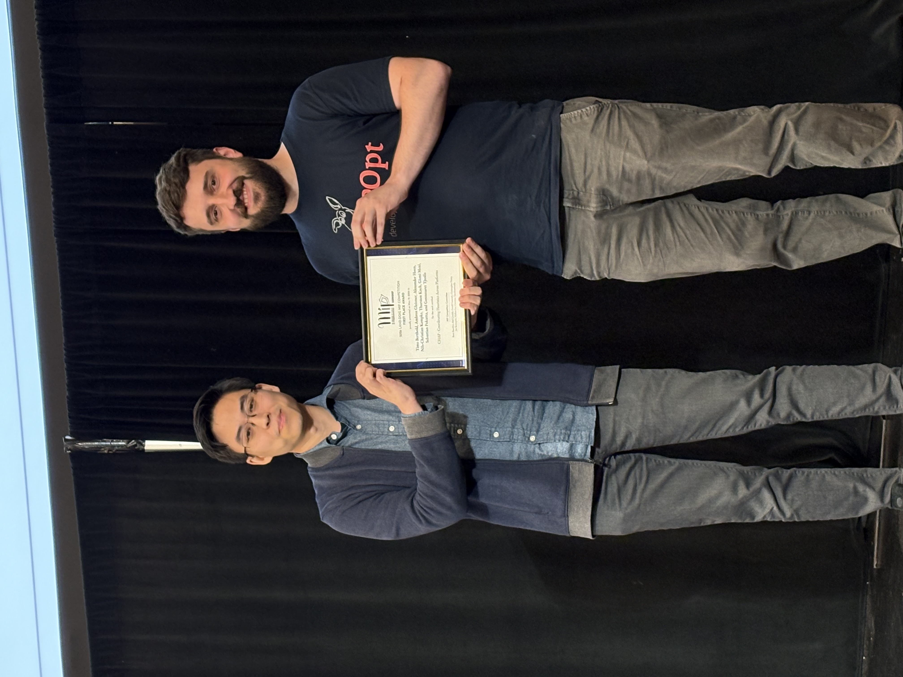

# MIPcc26: The 2026 Land-Doig MIP Competition


## About

The computational development of optimization tools is a key component within the MIP community and has proven to be a challenging task. It requires great knowledge of the well-established methods, technical implementation abilities, as well as creativity to push the boundaries with novel solutions. In 2022, the annual [Mixed Integer Programming Workshop](https://www.mixedinteger.org/2026) established a computational competition in order to encourage and provide recognition to the development of novel practical techniques within MIP technology. It was renamed in 2025 to honor Ailsa H. Land and Alison G. Harcourt (née Doig), with permission, who proposed the first LP-based branch-and-bound algorithm, a fundamental component of every modern MIP solver.

This year, the computational competition will focus on primal heuristics for general MI(L)P that can be enhanced by GPU acceleration.

The 2026 Land-Doig MIP competition is supported by [NVIDIA](http://nvidia.com/), who is providing NVIDIA GPU cloud credits for the development of submissions and as prizes.

<p align="center">
  
</p>

The competition is also supported by the [Mixed Integer Programming Society (MIPS)](http://mixedinteger.org), a section of the [Mathematical Optimization Society (MOS)](http://mathopt.org), via the [MIP workshop](http://mixedinteger.org/2026).

## The Challenge: GPU-Accelerated Primal Heuristics for MIP

The optimization community is seeing increasing momentum in the development of effective GPU-based optimization methods and in the ecosystem of libraries that facilitate research and implementation of GPU-based algorithms. For example, in linear programming, practical first-order LP methods such as PDLP/PDHG can efficiently run on a GPU, enabling speed-ups over traditional LP methods for a number of large-scale use cases. These algorithms are leveraged in emerging GPU-accelerated MIP solvers, such as cuOpt. In addition, we are increasingly seeing the use of GPU-accelerated differentiable optimization as subroutines in discrete optimization heuristics, made accessible by machine learning libraries such as PyTorch and JAX. These solvers and libraries are often open source, facilitating researchers to build on top of.

This competition is designed to boost research towards high-quality GPU-accelerated MIP solvers that push boundaries on large-scale problems that current CPU-based MIP solvers might struggle with. Modern MIP solvers contain a portfolio of various techniques such as branch-and-bound, cutting planes, presolve, heuristics, and so on, and we hope to see fresh new ideas and techniques that are inherently designed to leverage GPU acceleration. To provide a focal point, this competition centers around primal heuristics for general mixed-integer linear programming, as they are typically simpler to develop than exact methods and particularly useful for practitioners. In other words, we focus on algorithms that quickly find high-quality feasible solutions for mixed-integer linear programs using GPUs.

We especially welcome submissions from those who have never used a GPU before, particularly students, as well as those proficient in GPUs who have not done much optimization before. Our goal is not only to foster the development of algorithms, but also of the expertise in the community. To encourage this:

1. We will distribute NVIDIA GPU cloud credits to registered participants specifically to be used for this competition, provided by NVIDIA (see “Compute Infrastructure” section).
2. We provide learning materials to ease the learning curve for participants to implement GPU-based heuristics for MIP (see “Learning Materials” section). 

The task is to provide:

*   **Primal heuristic code** implementing one or more GPU-accelerated primal heuristics.
*   A **written report** describing the methodology and results.

To encourage the development of fundamentally novel techniques, this competition will have a special rule that **MIP solvers (or variants) must not be used as a subroutine**. Please see complete details in the Technical Rules section.

The jury will select one winner and up to two honorable mentions to present their work at the [MIP Workshop 2026](https://www.mixedinteger.org/2026/). The winning team will present in a regular session, whereas honorable mentions will present posters.

This year, NVIDIA provided a total prize pool of $2500 in GPU cloud credits:

*   The winning team was awarded $1500 worth of NVIDIA GPU cloud credits via [Brev](https://developer.nvidia.com/brev).
*   Each honorable mention team was awarded $500 worth of NVIDIA GPU cloud credits via Brev.

Furthermore, we will provide the following:

*   One representative of the winning team will receive travel support to the MIP workshop and free registration.
*   High-quality submissions will receive an expedited review process in Mathematical Programming Computation.


## Competition Results

The winners of the 2026 Land-Doig MIP Competition were:

* **First Place:** Timo Berthold, Ambros Gleixner, Alexander Hoen, Nils-Christian Kempke, Thorsten Koch, Gioni Mexi, Sebastian Pokutta, and Gennesaret Tjusila, for the work entitled *"CHAP - Coordinating Heuristics Across Platforms"* ([slides](competition_mexi_slides.pdf))

* **Honorable Mention:** Peng Lin, Zhe Wang, Kewu Yang, and Shaowei Cai, for the work entitled *"cuLocalMIP: A GPU-Oriented Local Search Framework for Mixed Integer Programming"* ([poster](competition_lin_et_al_poster.pdf))

* **Honorable Mention:** Yiran Zhu, for the work entitled *"GPU-MIP: A GPU-Native Local Search Solver for Mixed-Integer Programming"* ([poster](competition_zhu_poster.pdf))

<p align="center">
  
  <br>
  <em>Photo: Gioni Mexi receiving the first place award on behalf of the team.</em>
</p>

More details on the competition (e.g., brief instance descriptions, evaluation and review process) are in these [slides](competition_slides.pdf), which were presented on May 19th, 2026 at the 2026 MIP workshop at the University of Connecticut.

The committee thanks all of the participants for their submissions!

### Computational performance

Team numbers are randomly assigned. We asked teams if they wanted to have their team members public, keeping it anonymous by default. The following teams opted-in:

* **Team 2:** Peng Lin, Zhe Wang, Kewu Yang, and Shaowei Cai
* **Team 3:** Stefano Gualandi, Paul Juenger, Andrea Lodi, Vinit Ranjan, and Bartolomeo Stellato
* **Team 4:** Waquar Kaleem, Aleksandr Kazachkov, and Anirudh Subramanyam
* **Team 5:** Yupeng Wu and Jean Pauphilet
* **Team 9:** Yiran Zhu
* **Team 11:** Timo Berthold, Ambros Gleixner, Alexander Hoen, Nils-Christian Kempke, Thorsten Koch, Gioni Mexi, Sebastian Pokutta, and Gennesaret Tjusila

In the tables below, "Win." indicates the winner, "Hon." indicates honorable mentions, and "R2" indicates teams that made it to the second round of reviews. Please see the [slides](competition_slides.pdf) for details on the review process. In particular, the hidden set table below shows standard deviations only for second-round submissions as only those were ran multiple times.

The first two columns indicate primal integral and gap with respect to a strong heuristic baseline. The next two columns show primal integral and gap with respect to the best per-instance objective value obtained by a submission. The last two columns indicate the number of instances where a feasible solution was found, and the number of instances for which that submission found an objective value within 1% of gap to the best solution found by a submission. More details on the computational evaluation are in the [slides](competition_slides.pdf).

#### Performance on Hidden Set

| Team | Avg Primal Integral w.r.t. Reference | Avg Primal Gap (%) w.r.t. Reference | Avg Primal Integral w.r.t. Competition | Avg Primal Gap (%) w.r.t. Competition | # Instances w/ Sol. Found | # Instances within 1% Gap w.r.t. Competition |
| :--- | :--- | :--- | :--- | :--- | :--- | :--- |
| Team 1         | 312.79        | 100.80        | 300.92        | 94.71        | 16         |  0         |
| <span style="color: orange; font-weight: bold;">Team 2 (Hon.)</span>  |  63.84 ± 1.62 |  15.18 ± 0.15 |  44.97 ± 2.89 |  8.06 ± 0.74 | 50.0 ± 1.7 | 14.7 ± 1.5 |
| **Team 3 (R2)**    |  91.46 ± 2.20 |  17.79 ± 2.01 |  76.32 ± 2.22 | 12.75 ± 1.78 | 48.3 ± 0.6 | 11.7 ± 2.5 |
| Team 4         | 244.96        |  70.18        | 231.63        | 59.93        | 37         |  0         |
| **Team 5 (R2)**    |  85.40 ± 0.51 |  18.75 ± 0.70 |  67.57 ± 0.80 | 12.34 ± 0.85 | 45.3 ± 0.6 | 13.3 ± 0.6 |
| Team 6         | 211.58        |  61.98        | 199.84        | 56.74        | 29         |  0         |
| Team 7         | 225.80        |  69.90        | 196.84        | 59.64        | 34         |  0         |
| Team 8         | 170.82        |  53.62        | 148.24        | 42.68        | 36         |  3         |
| <span style="color: orange; font-weight: bold;">Team 9 (Hon.)</span>  |  73.97 ± 0.53 |  16.46 ± 0.77 |  55.98 ± 1.84 |  8.41 ± 0.74 | 48.0 ± 0.0 | 16.3 ± 1.2 |
| Team 10        | 171.38        |  45.24        | 159.32        | 39.68        | 35         |  3         |
| <span style="color: green; font-weight: bold;">Team 11 (Win.)</span> |  54.95 ± 0.06 |  12.91 ± 0.58 |  33.84 ± 0.30 |  6.03 ± 0.34 | 51.3 ± 0.6 | 19.3 ± 1.5 |

#### Performance on Test Set

| Team | Avg Primal Integral w.r.t. Reference | Avg Primal Gap (%) w.r.t. Reference | Avg Primal Integral w.r.t. Competition | Avg Primal Gap (%) w.r.t. Competition | # Instances w/ Sol. Found | # Instances within 1% Gap w.r.t. Competition |
| :--- | :--- | :--- | :--- | :--- | :--- | :--- |
| Team 1          | 200.96 | 48.78 | 191.17 | 41.56 | 36 |  4 |
| <span style="color: orange; font-weight: bold;">Team 2 (Hon.)</span>   | 70.05  | 14.34 | 52.37  |  7.81 | 44 | 13 |
| **Team 3 (R2)**     | 87.84  | 15.23 | 71.07  |  8.13 | 44 | 16 |
| Team 4          | 239.95 | 55.41 | 234.82 | 53.21 | 31 |  2 |
| **Team 5 (R2)**     | 75.28  | 14.09 | 59.59  |  7.88 | 44 | 14 |
| Team 6          | 196.71 | 49.83 | 182.57 | 44.39 | 34 |  3 |
| Team 7          | 231.51 | 72.00 | 219.00 | 67.57 | 37 |  0 |
| Team 8          | 109.71 | 30.91 | 94.64  | 25.57 | 41 |  3 |
| <span style="color: orange; font-weight: bold;">Team 9 (Hon.)</span>   | 64.82  | 14.39 | 48.77  |  8.43 | 41 | 15 |
| Team 10         | 173.10 | 46.66 | 165.53 | 43.23 | 37 |  1 |
| <span style="color: green; font-weight: bold;">Team 11 (Win.)</span>  | 52.69  | 11.95 | 32.12  |  5.27 | 47 | 19 |


## Timeline

*   October 13th, 2025: Publication of the topic, rules and set of test problems.
*   December 12th, 2025: Registration deadline for participation. 
*   March 20th, 2026 (AoE): Submission deadline for report and code.
*   April 2026: Notification of results.
*   May 2026: Presentations of the finalists at the MIP Workshop.


## Organizing Committee

*   [Beste Basciftci](https://sites.google.com/view/bestebasciftci)
*   [Akif Çördük](https://developer.nvidia.com/blog/author/acoerduek/)
*   [Gerald Gamrath](https://www.zib.de/userpage/gamrath/)
*   [Christopher Hojny](https://www.tue.nl/en/research/researchers/christopher-hojny)
*   [Jan Kronqvist](https://www.kth.se/profile/jankr)
*   [Haihao Lu](https://mitsloan.mit.edu/faculty/directory/haihao-lu)
*   [Christian Tjandraatmadja](https://research.google/people/christiantjandraatmadja/) (chair)


## Learning Material


### Tutorial

We provide a customized tutorial where we walk through implementing a local search heuristic on GPU, in particular feasibility jump. This tutorial is in Python and Colab for convenience.

* [2026 MIP Competition Tutorial: Local Search on GPU - Part 1: Introduction + a CPU implementation of feasibility jump](https://colab.research.google.com/github/mixedinteger/mixedinteger.github.io/blob/master/2026/competition/mip_competition_tutorial_part_1.ipynb)
* [2026 MIP Competition Tutorial: Local Search on GPU - Part 2: A GPU implementation of feasibility jump via Numba](https://colab.research.google.com/github/mixedinteger/mixedinteger.github.io/blob/master/2026/competition/mip_competition_tutorial_part_2.ipynb)
* [2026 MIP Competition Tutorial: Local Search on GPU - Part 3: A GPU implementation of feasibility jump via JAX](https://colab.research.google.com/github/mixedinteger/mixedinteger.github.io/blob/master/2026/competition/mip_competition_tutorial_part_3.ipynb)

We also provide a shorter CUDA C++ tutorial with an example of 2-opt.

* [2026 MIP Competition Tutorial: GPU-Accelerated 2-Opt Local Search for MIP in CUDA](https://www.mixedinteger.org/2026/competition/tutorial_2-opt.html)


### External sources

*   [This repository](https://github.com/NVIDIA/accelerated-computing-hub/tree/main) is a collection of tutorials in C++ and Python to learn how to use GPUs and a good starting point.
*   Material on CUDA: 
    *   [Talk on getting started with CUDA](https://www.youtube.com/watch?v=GmNkYayuaA4)
    *   [Course on CUDA with Python](https://github.com/numba/nvidia-cuda-tutorial)
    *   [Course on CUDA with C++](https://www.youtube.com/watch?v=Sdjn9FOkhnA&list=PL5B692fm6--vWLhYPqLcEu6RF3hXjEyJr)
*   Profiling/debugging:
    *   [Tutorial on profiling and debugging](https://www.youtube.com/watch?v=dB5Jxwj0PDw)
    *   [Webinar on profiling and debugging](https://www.youtube.com/watch?v=kKANP0kL_hk)
    *   [Documentation on profiling](https://docs.nvidia.com/nsight-systems/UserGuide/index.html#profiling-from-the-cli)
* Libraries such as [JAX](https://github.com/jax-ml/jax) and [PyTorch](https://pytorch.org/) are also accessible and efficient ways to perform computation on GPUs in Python.

## Competition Rules


### Rules for Participation

*   Participants must not be an organizer of the competition nor a family member of a competition organizer. Otherwise, there is no restriction on participation.
*   **In particular, student participation is strongly encouraged.**
*   Participants can be a single entrant or a team; there is no restriction on the size of teams.
*   Should participants be related to organizers of the competition (e.g. students), the rest of the committee will decide whether a conflict of interest is at hand. Affected organizers will not be part of the jury for the final evaluation. Please contact us if you are somehow related to one of the organizers.
*   To contact the committee for any questions, please email mipcc2026@gmail.com.


### Technical Rules

*   To encourage the development of fundamentally novel methods, **submissions must not use fully-fledged discrete optimization solvers (MILP, MINLP, CP, SAT, etc.)** as part of the heuristic, whether CPU-based or GPU-based. We loosely define “fully-fledged” as solvers that involve a portfolio of techniques and heuristics to solve a discrete optimization problem (exact or heuristic), independently of the parameters used to run it. For example, this includes SCIP, Gurobi, cuOpt, CP-SAT, BARON, etc. in their MIP form. If you have a borderline case, please contact the organizers.
    *   **LP solvers and other continuous optimization solvers (linear or nonlinear) are allowed.** If you would like to use a commercial solver, please contact the organizers first.
    *   In general, other software packages are allowed, but please contact the organizers if you plan to use some more unusual library.
*   Pure CPU submissions will not be considered, as the spirit of the competition is to encourage the development of GPU-based algorithms.
*   Machine learning techniques can be used within the heuristic, but there will be no training time and submissions cannot use pre-trained models. All runs will be independent from one another.
*   Submissions that have hyperparameters must have them fixed to a default in advance, bearing in mind that evaluation will also be done on a hidden set of instances. Submissions may try to tune them internally or adaptively, but that will be counted as part of the time limit.
*   A feasible solution must satisfy all constraints with a tolerance of 1e-6 and integer feasibility tolerance of 1e-5.
*   The source code may be written in any programming language.
*   The time limit for each instance is 5 minutes, excluding I/O and any compilation time, whether ahead-of-time or just-in-time.
*   Submissions must use a maximum of 8 CPU threads and 64GB of RAM in the CPU host. For GPU compute, see the Compute Infrastructure section.
*   **Update (Dec/17)**: Any compilation can be left out of the 5-minute time limit, whether ahead-of-time or just-in-time. If you are using just-in-time compilation (e.g. Python), please trigger a compilation and record the time in the timing file (see instructions below). If your compilation is ahead-of-time (e.g. C++), you do not need to record your compilation time.

In case participants have any questions about the implementation of specific rules, they should not hesitate to contact the organizers.


### Input/Output

The code must read the problem in gzipped MPS format, and write two types of files:

1. a set of **solution files**, each logging the best found solution so far, using the MIPLIB solution format (described below). Each file should contain a solution and be named “solution_i.sol”, where “i” is the order that the solutions were found starting at 1 (solution_1.sol, solution_2.sol, etc.).
2. a single **timing file**, containing a list of times when each solution was found, named “timing.log”.

The solution files must be generated at roughly the same time as when the solution is reported in the result file. The files must be formatted as follows:

1. Each solution file follows the MIPLIB format, which is the following:
    *   The first line must contain the string “=obj=”, followed by the objective value of the solution. These should be separated by whitespace (any amount of spaces or tabs).
    *   The following lines must contain one variable per line with the variable name, followed by the solution value of the variable. These should be separated by whitespace (any amount of spaces or tabs).
    *   **Important:** Please ensure that the objective and solution values are output with full floating point precision and not truncated. If you do not do so, solutions might end up not within tolerances and not counted. If the objective value is tracked in some form that could lead to numerical imprecision (e.g. iteratively), we recommend that you recompute the objective value from scratch when writing the solution file.

        **Example solution file:** Please refer to any solution file in the [MIPLIB website](https://miplib.zib.de/) ([example](https://miplib.zib.de/downloads/solutions/30n20b8/2/30n20b8.sol.gz)).

2. The timing file contains the elapsed wall time at which each solution was found.
    *   Each line must contain the filename of the solution (e.g. “solution_1.sol”), followed by the wall time when that solution was found. These should be separated by whitespace (any amount of spaces or tabs).
    *   The format for timing is in seconds, 3 decimal places, number only (no “s”).
    *   Submissions may exclude the time it takes to read the MPS file for the time limit. To do so, please track the time it takes to read the MPS file. Then, when writing the elapsed wall times, subtract that value. For our own checking, please also report the loading time by including as the first line in the timing file the string “input”, followed by the time it took to read the MPS file, in the same format as above. If that line is not present, we will assume that you have opted to not subtract any time.
    *   Solutions with reported times that are higher than the time limit plus a tolerance of 1s (i.e. 301s) will be ignored. In other words, all reported solution times in the timing file must be at most this limit. **We recommend that submissions include that check in their code.**

        **Example timing file:**
        ```
        input   0.129
        solution_1.sol   10.248
        solution_2.sol   69.831
        solution_3.sol   173.591
        solution_4.sol   300.020
        ```

   * Note that the printed solution time values must already have had the input time subtracted, e.g. in the example above, solution_1 was actually found at 10.248 + 0.129 = 10.377s.

   * **Update (Dec/17)**: If you are using just-in-time compilation, please trigger a compilation and record the compilation time in the timing file separately. Use the string "compilation". If your compilation is ahead-of-time, you do not need to do this. 


It is recommended that submissions use a separate thread to write solution files. The reported time should be the time right before writing the solution, and it is ok if the execution runs longer to finish writing, as long as the last solution is found before the time limit.


### Solution Checker

During evaluation, we plan on using MIPLIB’s official solution checker, which can be found inside the scripts package miplib2017-testscript-v1.0.4.zip in the [MIPLIB Downloads page](https://miplib.zib.de/download.html). For convenience, we repackage only the checker [here](miplib2017-checker.zip). Importantly, the checker must be run with the tolerances above, as its default tolerances are looser: ./solchecker &lt;model.mps.gz> &lt;solution.sol> 1e-6 1e-5. **We strongly recommend participants to run the checker themselves over all solutions produced by the submission.** Solutions that fail the checker will not be considered valid.

**Update (Dec 9, 2025):** We have repackaged the above checker to fix a bug with objective offsets, so please use the checker we provide instead of the original MIPLIB one. For posterity, we have applied [this patch](solchecker.patch) to the original MIPLIB checker.


### Problem Instances

The test set of problem instances can be found [here](https://drive.google.com/file/d/1AcD7oW0grX7lWtHI0T5ke_6NeFi1kuKq/view?usp=sharing). All files are in gzipped MPS format. All instances belong to the class of mixed-integer **linear** problems.

To encourage generality, the 50 instances in the test set were selected to be diverse, containing 18 different problem classes from typical MIP applications. In addition, the instance set contains several difficult or large-scale instances to align with the goal of pushing boundaries on what can be solved, especially given that most of the recent potential in GPU algorithms for LP/MIP come from large-scale applications.

This year, our **set of problem instances will be already presolved by Gurobi**. The intent with having a presolved set is to put presolve out of the way so that submissions can focus on the heuristic itself. However, we recognize that certain approaches may work best if they can detect special problem structure, which may be lost during presolve. Therefore, we provide the original set [here](https://drive.google.com/file/d/1AVSYK06ec_dxZ-p97EYVqQ6KmJ9oChdi/view?usp=sharing), and offer the option for participants to run on the original set if they wish (this will be asked at submission).

For evaluation, we will run the code on a hidden set of problem instances as well. The hidden set will be slightly harder than the test set. Approximately half of the hidden set will be instances from problem classes present in the test set, and the other half will be unseen problem classes.

For reference, we provide [objective values](instance_5m_bounds.txt) after running Gurobi with a time limit of 5 minutes. These are informative only.


## Evaluation Criteria

The spirit of this competition is to encourage the research and implementation of novel GPU-based algorithms for MIP, and as such, the jury will evaluate submissions by two criteria:

1. By **performance**, based on a combination of [primal integral](https://webdoc.sub.gwdg.de/ebook/serien/ah/ZIB/ZR-13-17.pdf) and final objective value of the heuristic.
2. By **innovation**, which will be an evaluation by jury of the method and implementation.

Given subtleties with GPU algorithms, the jury reserves the right to adjust the evaluation criteria if we run into unforeseen scenarios, but the jury will follow the spirit of the above criteria.


### Performance criterion

To compute the performance of the heuristic, we will run the code on both the public and hidden instances, and rank the **[primal integral](https://webdoc.sub.gwdg.de/ebook/serien/ah/ZIB/ZR-13-17.pdf) and final objective value** of the submissions. We expect high-quality submissions to do well in both metrics, not just one or the other.


### Innovation criterion

Given that this competition is designed to encourage innovation in effective GPU algorithms for MIP, the method and implementation itself will be as important as its performance. The jury will review the report for both **methodological and engineering innovations**. For example, a submission with strong methodological innovation might propose a novel algorithm designed for GPUs from the ground up that may be different from what is typically seen in the MIP literature. A submission with strong engineering innovation might have clever implementations of GPU kernels or data structures that best utilize the GPU. That said, we advise participants to not be constrained by the two categories above. Either a strong implementation of an existing method or a straightforward implementation of a novel method would be excellent candidates.

Please be aware that writing quality impacts this criterion as well. We do not expect the report to be at the level of a published paper, but treat it as if you are writing one. Importantly, please be clear on what is novel in your method and add relevant citations for the parts of your method that are based on existing work.

Additionally, certain heuristic frameworks might naturally produce dual bounds, which are useful for an exact MIP solver. At the jury’s discretion, we may consider a bonus if a method is able to produce good dual bounds as a byproduct. Participants are responsible for showing some computational evidence that these can be reasonably better than LP bounds, but it does not need to be comprehensive. We will not rank these bounds computationally and they will only be considered for this criterion.


## Compute Infrastructure and GPU Credits

The competition will provide compute infrastructure to participants via [NVIDIA Brev](https://developer.nvidia.com/brev), sponsored by NVIDIA. NVIDIA Brev provides access to various cloud services in an optimized way that reduces the setup and management process for GPU infrastructures.

Each team will be provided with cloud credits that they can use for GPU development, debugging, and benchmarking. The credits will be allocated to each team’s Brev org and team members can consume the same credit pool. Credits will be provided on a rolling basis after teams register, typically within a few weeks of registration. Credits are not guaranteed given that our pool is finite: depending on the number of registrants, we may prioritize teams mainly composed of students, which can be indicated in the registration form.


### Recommendations on credits and the development environment

Since the credit is limited for each team, we recommend teams use compute frugally by using the compute instances during active development and debugging. Two types of GPUs will be available in this development environment, [L40](https://www.nvidia.com/en-us/data-center/l40/) and [H100](https://www.nvidia.com/en-us/data-center/h100/). We recommend using L40 for development as it consumes fewer credits, and H100 for benchmarking as the jury evaluation will be done on H100 SXM5. 

Some cloud providers provide persistent storage and env, some do not. Providers with persistent storage have higher per hour cost and a fixed per hour storage cost even if the instance is offline. We recommend using persistent instances for ease of use, but managing cloud credits is the responsibility of the participants. **Please be careful to stop instances if not used, otherwise the credits will be consumed.**

Brev is flexible where one can have setup scripts or start with custom containers. We recommend using the launchable workflow with a suggested [development](https://brev.nvidia.com/launchable/deploy?launchableID=env-32rpINwmxV6wk3LTYTxrmNo11Dw) launchable which contains python3, CUDA drivers and toolkit, sanitizer and debugging tools, jupyter and basic development tools. Brev provides an intuitive and easy way to access the development environment with a command line command. Developers can also directly launch a vscode instance which is automatically connected to the remote GPU instance. The documentation can be found [here](https://docs.nvidia.com/brev/latest/index.html).


## Submission Requirements


### Registration

Registration is now closed.


### Report

All participants must submit a written report of **10 pages maximum** plus references, in Springer LNCS format. The report and the code must be submitted together by **March 20, 2026 (AoE)**.

The report must include the following information:

*   A description of the method developed and implemented, including any necessary citations to the literature and software used.
    *   Include a discussion on why your method is particularly suitable for GPUs. If possible, we encourage participants to include a computational comparison between a GPU and CPU implementation.
    *   Pseudocode and/or figures to help explain the method are welcome.
*   A section discussing the methodological and/or engineering innovations of the method (see Evaluation Criteria above). 
    *   If you have any clever implementation techniques to showcase (e.g. performance optimization), please highlight them in this section rather than simply leaving it in the code.
    *   We strongly encourage the inclusion of GPU utilization statistics in this section as evidence of a well-engineered implementation, particularly given that this will be important to obtain good results. Please see the “Learning Materials” section for some guidance on how to profile with GPUs.
*   Computational results on the competition test set. 
    *   Include a table with all primal integral and final objective values for all test set instances, along with the provided Gurobi objective values as a baseline for comparison. Include also aggregated values. 
    *   The complete table may be put in the appendix and does not count towards the page limit. Please put the aggregated results in the main portion of the report and provide a discussion.
    *   Further statistics, visualizations, and analyses are welcome.


### Code

Participants are responsible for setting up the Brev environment that we provide to be able to run the heuristic. In addition, participants must produce two shell scripts: one that will build the code, named `build.sh`, and one that will run the code, named `run_heuristic.sh`, that takes in two arguments:

1. The first argument is the path in the filesystem to the instance to read, in gzipped MPS format.
2. The second argument is the path in the filesystem where the method should write the results (files for solutions found and a result file).

More detailed instructions for submission have been provided directly to registered participants via email. Please email us if you were registered and have not received the instructions.
